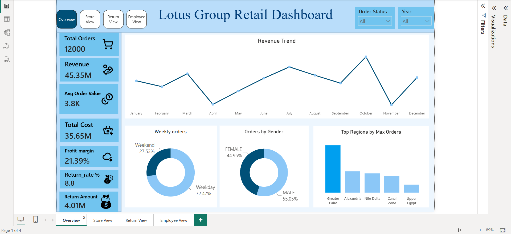
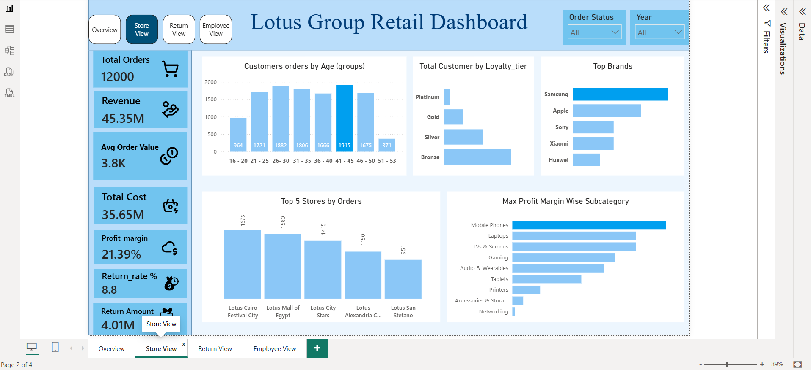
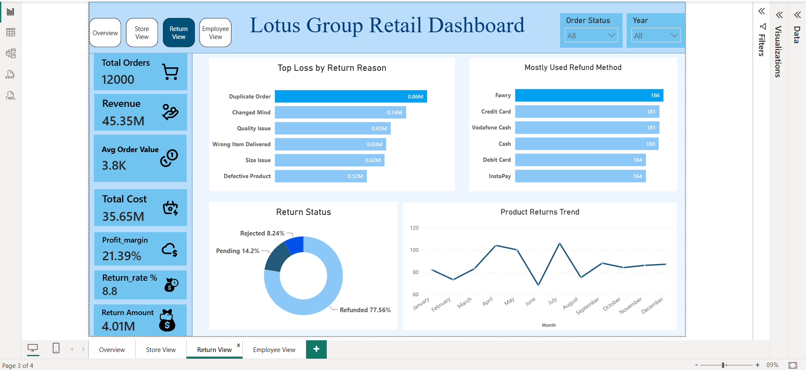
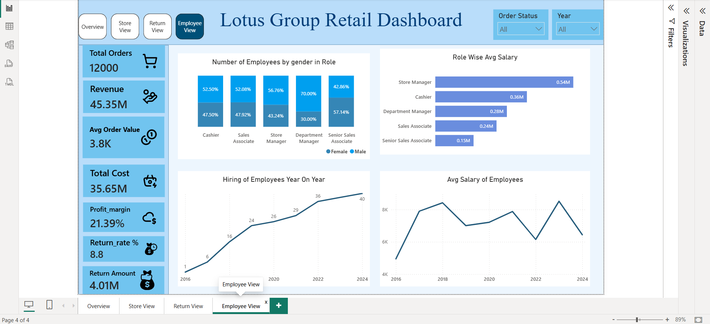

# Lotus Group Retail — Power BI Business Intelligence Project

## 📊 Project Overview

This project analyzes **Lotus Group retail operations** using SQL and Microsoft Power BI. The objective is to transform multi-table retail data into actionable business insights across sales, customers, returns, employees, payroll, and diversity.

The project follows a business intelligence workflow:

**Raw Data → Data Quality Checks → SQL Analysis → Star Schema → Power BI Data Model → DAX Measures → Interactive Dashboard → Business Insights**

---

## 🎯 Business Objectives

The analysis focuses on the following business areas:

* Sales and order performance
* Customer purchasing behavior
* Geographic order trends
* Return and rejection analysis
* Duplicate-order monitoring
* Employee and salary trends
* Gender diversity
---

## 🗂️ Data Model

The project uses a **star-schema-based data model**, with fact tables containing transactional information and dimension tables providing descriptive attributes.

### Main analytical areas

* Orders
* Customers
* Products
* Employees
* Departments
* Returns
The star-schema approach makes the model easier to analyze and supports efficient filtering, aggregation, and time-based analysis in Power BI.

---

## 🛠️ Tools & Technologies

| Tool            | Purpose                                            |
| --------------- | -------------------------------------------------- |
| **SQL**         | Data exploration, validation and business analysis |
| **Power BI**    | Interactive dashboards and reporting               |
| **DAX**         | KPI and analytical measure creation                |
| **Power Query** | Data transformation                                |
| **Star Schema** | Data modeling                                      |

---

## 📈 Key KPIs

The dashboard tracks important business metrics such as:

* Revenue
* Total Orders
* Profit Margin %
* Total Cost
* Return Rate %
* Return Amount
* Average Order Value
---

## 🔍 Key Business Insights

### 1. Order Performance

Weekday orders dominate overall demand, with **Greater Cairo contributing the largest share of orders**. Customers aged **21–50** represent the core customer segment.

### 2. Return Performance

The overall return rate is relatively low at approximately **8.6%**. However, around **20% of returned orders are classified as duplicate orders**, indicating a potential opportunity to investigate order-processing issues and customer ordering behavior.

### 3. Return Rejections

Defective-products-related issues represent an important reason for rejected return requests. This highlights a potential opportunity to investigate **product quality, return handling**.

### 4. HR & Payroll

Salary trends do not consistently align with revenue performance. Salaries appear to increase during lower-revenue years and decrease during more profitable years, suggesting that management should investigate the relationship between **payroll costs, workforce changes, and business performance**.

### 5. Diversity Progress

Female representation in **department-manager positions has increased consistently since 2022**, accompanied by steady salary growth. This indicates positive progress in managerial diversity and career development.

---

## 💡 Recommendations

Based on the analysis, the following areas deserve further investigation:

1. product-quality issues should be addressed.
3. Salary should be according to revenue and profitability.
5. Focus customer campaigns on the core **21–50 age segment**.
6. Product supply should be increase in  Greater Cairo as per demand.
7. Less product returns, more order completion will increase company's revenue.

---

## 📊 Dashboard Pages






## 📁 Repository Structure

```
Lotus-Retail-data-analysis/
│
├── README.md
└── Lotus-Retail-data
```
---

## 📚 Dataset

The project uses the **Lotus Retail Dataset – Power BI (Multi tables)** published on Kaggle.

**Dataset:**
[https://www.kaggle.com/datasets/abdelrahmanmahmoud22/lotus-group-retail-star-schema-bi](https://www.kaggle.com/datasets/abdelrahmanmahmoud22/lotus-group-retail-star-schema-bi)


---

## 🚀 Project Workflow

```
Kaggle Dataset
      ↓
Data Quality Checks
      ↓
SQL Exploration & Analysis
      ↓
Star Schema Modeling
      ↓
Power Query Transformation
      ↓
DAX Measures
      ↓
Power BI Dashboard
      ↓
Business Insights
      ↓
Business Recommendations
```

---

## 👤 Author

**Ravi**

Aspiring Data Scientist

### Skills

`SQL` · `Power BI` · `DAX` · `Power Query` · `Data Modeling` · `Data Analysis`.

---
